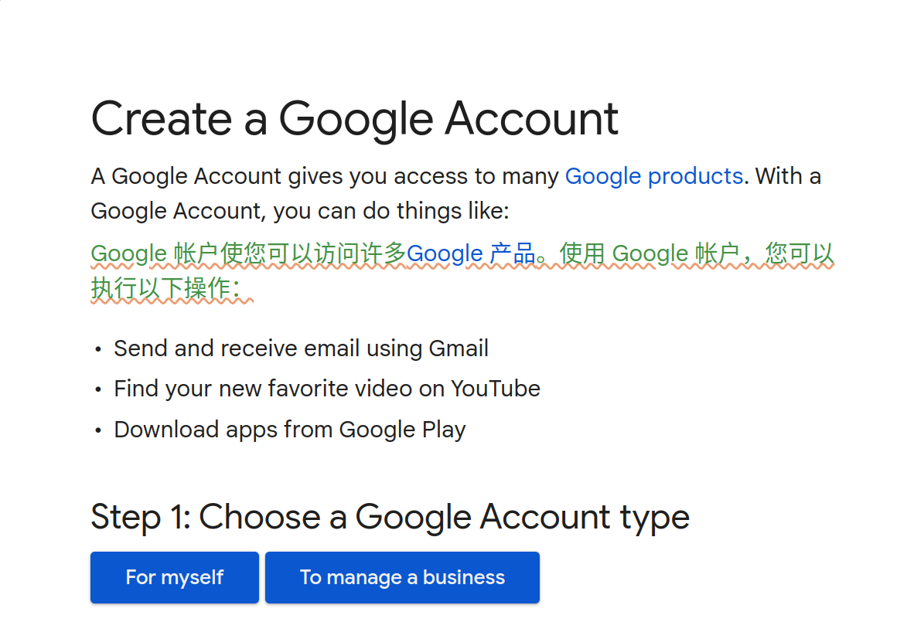
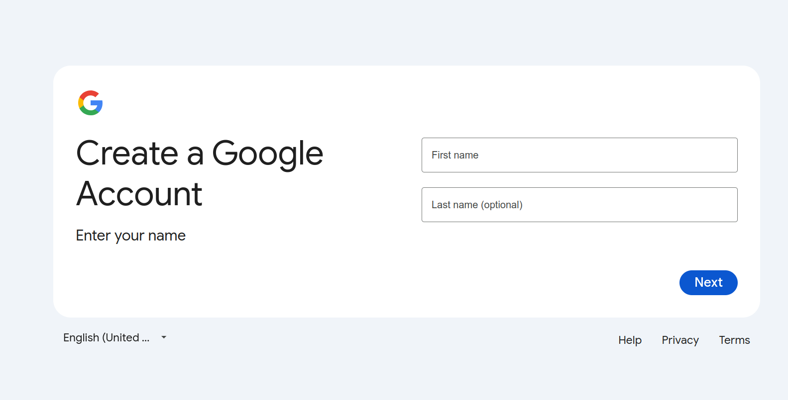
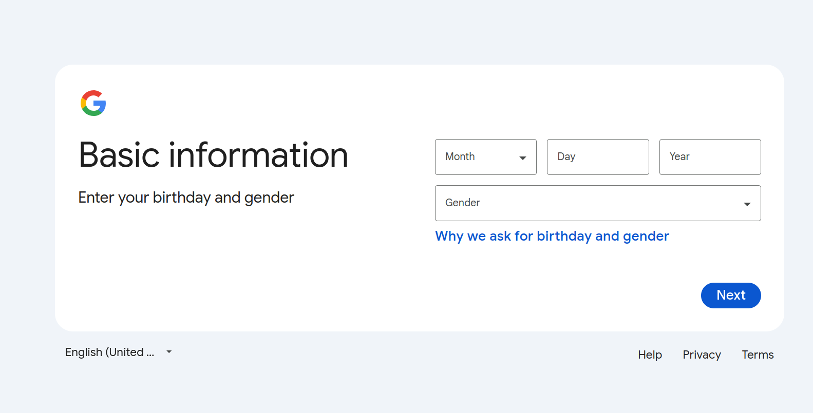
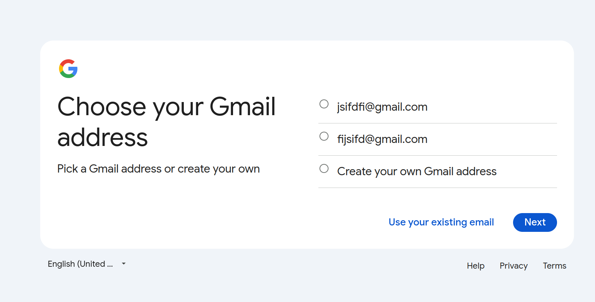
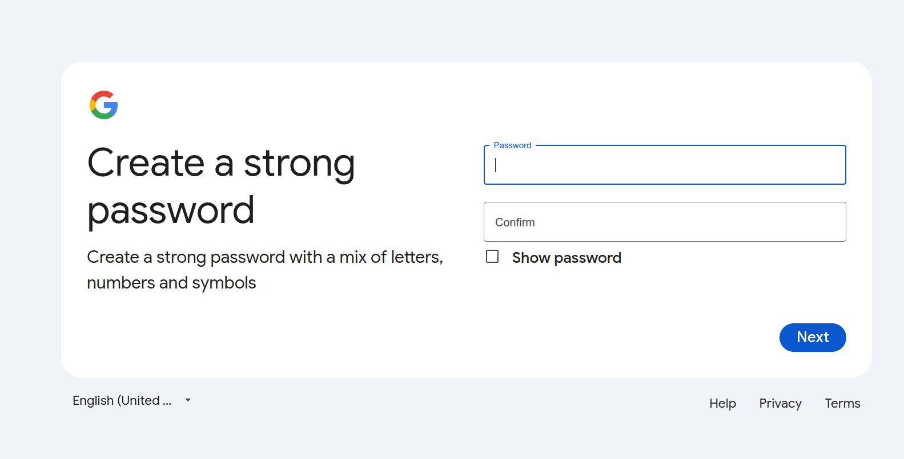
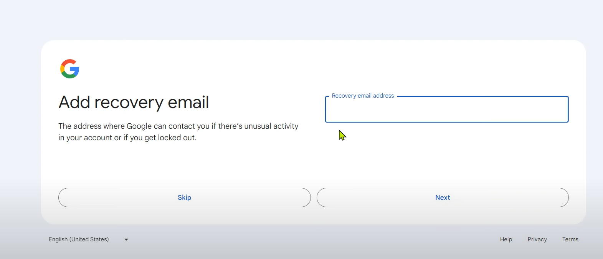

[toc]

# 如何创建google账户
**注意**:  
<u>笔者在创建 google 账户时是成功的，而在编写该文档时为了截图就重新操作了一遍，并没有 步骤9 中的 **skip** 按钮(步骤9的截图来源于[参考视频](#参考视频)，而是必须填写手机号(本人前几次失败也是这样)，原因不详。可过几天再尝试</u>
## 1. 解决网络问题
首先通过科学上网的方式，解决无法访问外网的问题
* 机场  
本人使用的机场是[SSRDOG](https://dog.ssrdog.com/)，对于新用户来说第一个月免费。
* 桌面代理软件  
本人使用的是[clash verge](https://clashverge.net/)，我使用她的原因如下：  
    1. 开源免费，无需登陆;
    2. Android/Windows/macOS/iOS/Linux 都可用.
## 2. 科学上网节点的选择
请选择**美国**的节点，我失败的原因之一就是使用了香港节点。
## 3. 开始创建账户
1. [登陆网址](https://support.google.com/)
2. 选择 **Google Accounts** 选项
3. 在 **Browse help topics** 中选择 **Popular articles** --> **Create a Google Account**，在新页面中部分显示如下:
    
4. 选择 **For myself**
5. 输入用户名, 然后**Next**
    
6. 输入一些基本信息，然后**Next**
    
7. 在该页面中将显示系统根据输入的用户名分配的两个google邮箱地址，你可以任选一个，若觉得**不好看**，可以选择**Create your own Gmail address**, 然后输入符合自己气质的邮箱地址，然后**Next**。
    
8. 输入用户密码
    
9. 如果幸运的话，将来到**Add recovery**的界面，为了简便，可以直接点击**skip**
    
10. 点击**Next**，点击**I agree**，到此账户注册成功
# 参考视频
[2024最新绕过手机验证 无限注册 100%成功注册Google谷歌账号 无需短信验证 无需花钱找接码平台 轻松创建Gmail谷歌邮箱 谷歌网盘 Youtube等账号](https://www.youtube.com/watch?v=wU3EnawyaSs)
