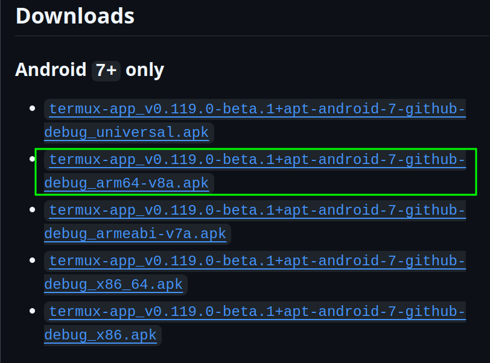
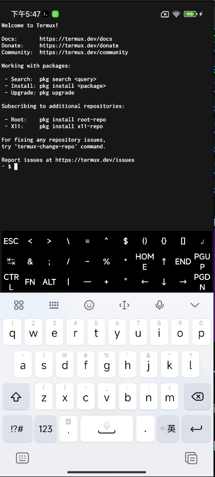
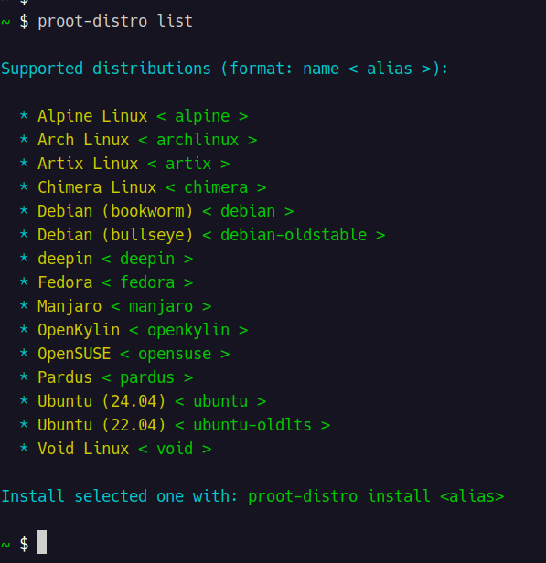
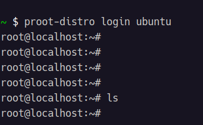
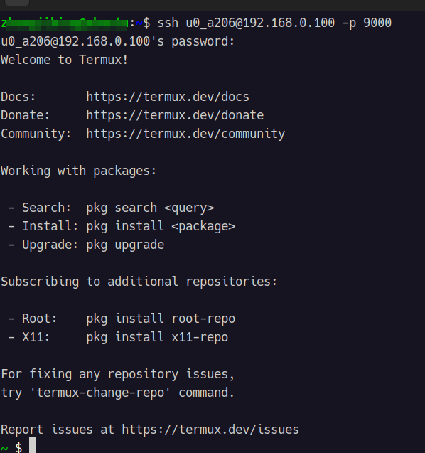

[toc]

# 在安卓手机中使用linxu虚拟机
## 简介
由于笔者需要，便尝试如何在安卓手机中使用linux虚拟机。步骤如下：
1. 安装 termux
2. 在 termux 中安装 proot 和 proot-distro
3. 使用 proot-distro 安卓 linux 虚拟机
## 安装 termux
* 进入[官网](https://github.com/termux/termux-app)
* 点击 Releases 查看发行版本 

* 下载适合自己手机的版本,笔者选择如下所示：

* 将下载好的 apk 拷贝到手机上，然后点击 apk 文件即可安装,安装好后如图所示：

## 安装 proot 和 proot-distro
* 点击打开 termux 软件  
  
* 安装方式
    * pkg 安装
    ```shell
    pkg upgrade
    pkg install proot proot-distro
    ```
    * apt 安装
    ```shell
    apt install proot proot-distro
    ```
>NOTE: <u>然而笔者还是更喜欢在键盘上敲命令，所以选择了远程连接(远程连接到 termux)的方式进行后续操作，当然在远程连接之前的准备工作，还是需要在 termux 中敲命令的。</u>
## 安装 ubuntu
* 查看可以安装哪些 linux 版本: `proot-distro list`

* 安装linux（笔者选择 Ubuntu 24.04,即 ubuntu, 安装时需要满足能访问github):
```shell
proot-distro install ubuntu
```
* 启动linux: `proot-distro login ubuntu`

## 远程连接到 termux
1. 让电脑和手机连接同一个局域网
2. 安装ssh服务器
```shell
pkg install openssh
```
3. 启动ssh
```shell
sshd
```
4. 查看ip地址、sshd端口号、用户名、密码
    * 查看用户名：`whoami`
    * 设置用户密码：`passwd`
    * 查看ip：`ifconfig 2>&1 | grep -oP "192\.168\.[0-9]+\.[0-9]+" | head -n 1`
    * 设置sshd端口号：`sshd -p 9000`
5. 在电脑上远程连接:`ssh <user_name>@<ip> -p <port>`, 然后输入密码即可登陆：

