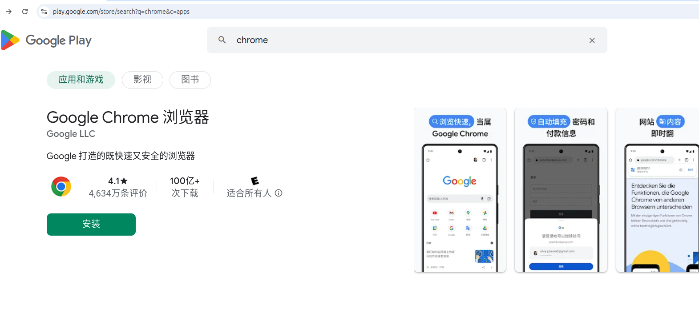
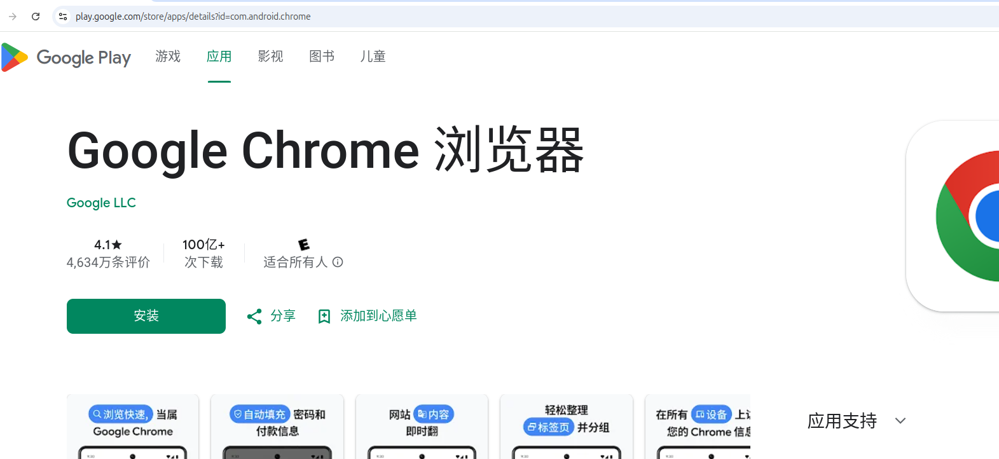
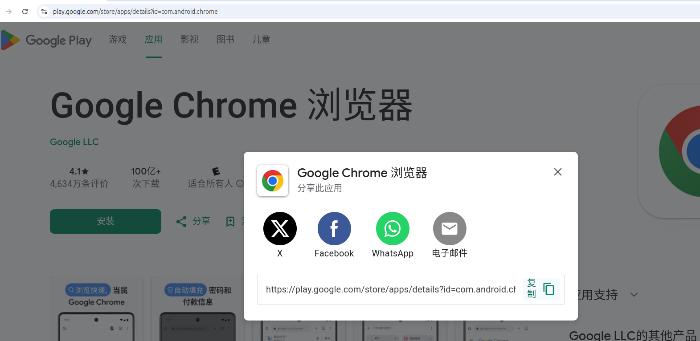
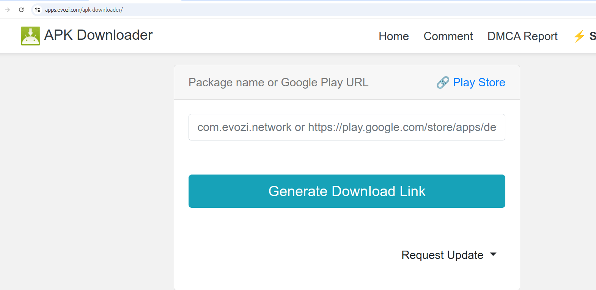

[toc]

<u></u>
# 如何下载 google chrome 安卓版
## 解决科学上网的问题
[科学上网](https://github.com/zhang20204/tools/blob/main/%E7%A7%91%E5%AD%A6%E4%B8%8A%E7%BD%91/index.md)
## 找到 chrome 在google play中的url
1. 打开[google play](https://play.google.com/store/games)，并选中 **手机**
    
2. 在搜索栏中搜索 "chrome"
    
3. 点击 **Google Chrome 浏览器**
    
4. 点击 **分享**
    
5. 复制 url
##  下载 chrome
1. 打开 [apk-downloader](https://apps.evozi.com/apk-downloader/)
    
2. 将在 **google play** 中复制的 url  粘贴到里面 ,点击 **Generate Download Line** 生成下载链接
    
3. 点击 **Click here to download com.android.chrome now** 下载即可下载chrome apk

# 趣事
说来还蛮搞笑的。  
&emsp;笔者原本打算是下载[Firefox(火狐)](https://www.mozilla.org/zh-CN/firefox/browsers/mobile/android/)的，但发现这玩意儿现在无法直接下载(我记得之前firefor,chrome都是可以直接下载apk的)，要下载就需要转到google paly，无语...  
&emsp;然后就开始进 google play的官网，接着search, install, 提示我必须登陆，再次无语...  
&emsp;好吧那就登录吧。登陆google paly 之后发现还是无法直接下载，说什么“此 Google 帐号尚未与设备关联。请在安装应用之前访问您设备上的 Play 商店应用。”，无语plus...  
&emsp;当我在网络中寻回了解决办法时发现，既然安卓版 firefox 和 chrome 都需要在 google play 中才能获取，那我为什么不直接下载安装 chrome 呢？这在有了这篇博客。
