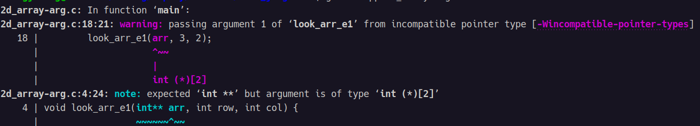

[toc]

# 二维数组作为函数参数的问题
通常在c函数中定义二维数组参数时，喜欢把二维数组当作二级指针来处理。但是这样就会引出其他一些问题：
1. 二维数组传入函数时，出现 **不完整的数据来袭** 的警告  
2. 在函数中无法向 **访问二维数组** 那样回去数组元素，也无法通过 **直接解析地址** 的方式访问数组元素，程序会直接崩溃。  

## 示例
* 代码
```c
// 2d_array-arg.c

#include <stdio.h>

// 定义查看二维数组第一个元素的函数
void look_arr_e1(int** arr, int row, int col) {
	int e1;
	e1 = arr[0][0];
	printf("e1=%d\n", e1);
}

int main(int argc, char* argv[])
{
	// 定义一个3x2的二维数组
	int arr[3][2] = {
		{1, 2},
		{3, 4},
		{5, 6} };

	look_arr_e1(arr, 3, 2);

	return 0;
}
```
* 编译运行结果:  
  
run 时则提示 **段错误**  
## 解决
1. 对于 **warning** 来说，在 arr 传入函数是直接强制类型转换即可:
```c
look_arr_e1((int**)arr, 3, 2);
```
2. 对于这个段错误就是大问题了，解决方式的核心也是强转，难点在于对 **数组指针** 的理解如何。在示例中 arr 的列数为 col 则在函数中要使用前，可先将 arr 强转为列数为 col 的数组指针:
```c
int (*arr_ptr)[col] = (int (*)[col])arr;
```
* 完整代码
```c
// 2d_array-arg.c

#include <stdio.h>

// 定义查看二维数组第一个元素的函数
void look_arr_e1(int** arr, int row, int col) {
	int (*arr_ptr)[col] = (int (*)[col])arr;
	int e1;
	e1 = arr_ptr[0][0];
	printf("e1=%d\n", e1);
}

int main(int argc, char* argv[])
{
	// 定义一个3x2的二维数组
	int arr[3][2] = {
		{1, 2},
		{3, 4},
		{5, 6} };

	look_arr_e1((int**)arr, 3, 2);

	return 0;
}
```
